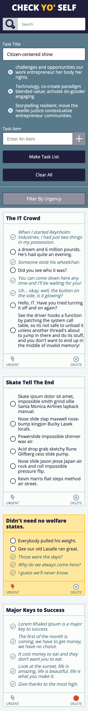

# Check Yo'Self Project

## Table of contents
* Built With 
* Screenshots
* Features
* Try It Out
* Take It For A Spin
* Why'd We Do This?

## Built With

- HTML5
- CSS3
- JavaScript

## Screenshots
### Prompts:
  
  
  
  
  
### Actual:

  
  
  

## Features

- [x] Altering page content via input fields (JS)
- [x] Responsive (CSS Media Query with 1 break points)
- [x] Logic to search through and show mathcing titles, tasks & urgent
- [x] localStorage to persist data
- [x] Maniuplate date model and dom data

## Try It Out

1. Grab your keys and start heading over to the store!

2. This To-Do App will help you stay orgainzed and never forget anything when you're pushing two carts at the grocery store.

3. Enter the list name and tasks, then create your To-Do List!

4. As you go through your list check off what you've done.

5. Each card has the ability to be marked as urgent with visiable changes to the card.

6. Search through your list titles, tasks and by urgent cards!

7. Mobile and desktop layout, so while you're staying up late at night you can be createing To-Do Lists on your phone.

## Take It For A Spin

View <a href=https://matthewdshepherd.github.io/check-yo-self/>here</a> on GitHub.

OR 

Download and unzip the check-yo-self.zip file, and open the index.html file to view the website.

## Why'd I Do This?

I am a student at Turing School of Software and Design, whom provioded the project specifications and website design. I am learning all the things on my way to becoming a Software Engineer.
